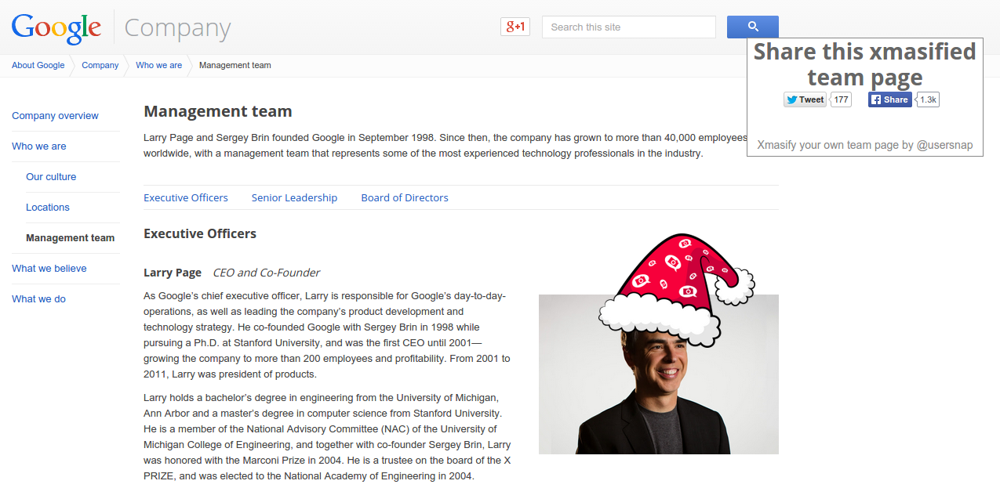

Xmasify the Google Exec Page
============================

Open up http://www.google.com/about/company/facts/management/ and use the following
fine tuned Santa Hat placements:


```
  (function() {
      var s = document.createElement("script");
      s.type = "text/javascript";
      s.async = true;
      s.src = '//usersnap.github.io/xmasify/xmasify/xmasify.js';
      var x = document.getElementsByTagName('script')[0];

      s.onload = function() {
          Xmasify.xmasify({
              wrap_sel: '#company-execs',
              member_sel: '.company-exec',
              disableSound: false,
              static_dir: "//usersnap.github.io/xmasify/xmasify/",
              pos_map: [{
                  top: -50,
                  left: 580
              }, {
                  top: -50,
                  left: 580
              }, {
                  top: -10,
                  left: 470,
                  flip: true
              }, {
                  top: -50,
                  left: 580
              }, {
                  top: -50,
                  left: 580
              }]
          });
      };
      x.parentNode.insertBefore(s, x);
  })();
```

Trivia
======

Xmasify.js was created by [@josef_trauner](https://twitter.com/josef_trauner) and [@dorfbauer](https://twitter.com/dorfbauer) for [Usersnap](https://usersnap.com/?gat=xmas).
Never ask for a screenshot again - get it from the visual bug tracker [Usersnap](https://usersnap.com/?gat=xmas).
