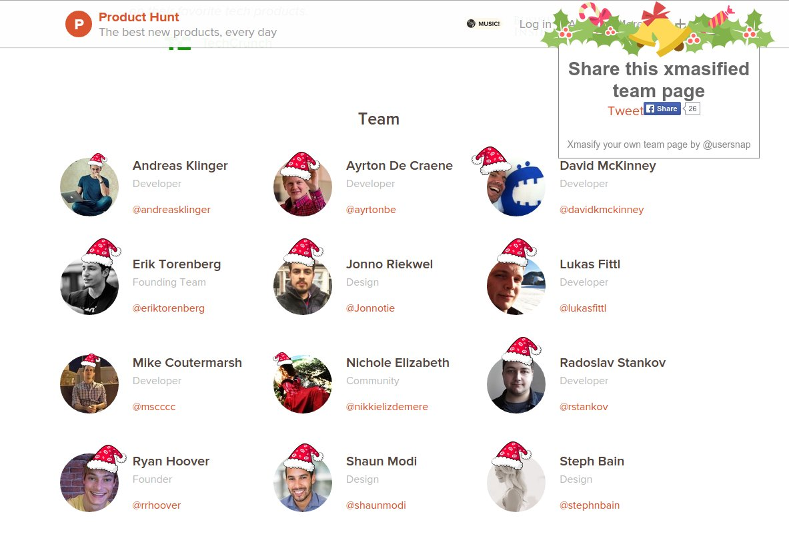

Xmasify the Product Hunt Team Page
==================================

Open up http://www.producthunt.com/about and use the following
fine tuned Santa Hat placements:


```
jQuery('li.p-about--team--item').css('overflow', 'initial');
jQuery('section.p-about--team').css('overflow', 'initial');

(function() {
    var s = document.createElement("script");
    s.type = "text/javascript";
    s.async = true;
    s.src = '//usersnap.github.io/xmasify/xmasify/xmasify.js';
    var x = document.getElementsByTagName('script')[0];

    s.onload = function() {
        Xmasify.xmasify({
            wrap_sel: '.p-about--team--list',
            member_sel: '.p-about--team--member',
            disableSound: false,
            static_dir: "//usersnap.github.io/xmasify/xmasify/",
            defs: {
                width: 60,
                left: 15,
                top: -27
            },
            pos_map: [{
                top: -7,
                left: 41,
                width: 30
            }, {
                left: 10,
                top: -9
            }, {
                flip: true,
                left: -23,
                top: -17
            }, {
                left: 32
            }, {}, {}, {
                width: 30,
                top: -2,
                left: 31
            }, {
                flip: true,
                width: 30,
                top: -4,
                left: -1
            }, {
                left: 22
            }, {
                left: 40,
                top: -13
            }, {
                top: -15
            }, {
                top: -18,
                left: 7
            }]
        });
    };
    x.parentNode.insertBefore(s, x);
})();
```

Trivia
======

Xmasify.js was created by [@josef_trauner](https://twitter.com/josef_trauner) and [@dorfbauer](https://twitter.com/dorfbauer) for [Usersnap](https://usersnap.com/?gat=xmas).
Never ask for a screenshot again - get it from the visual bug tracker [Usersnap](https://usersnap.com/?gat=xmas).
